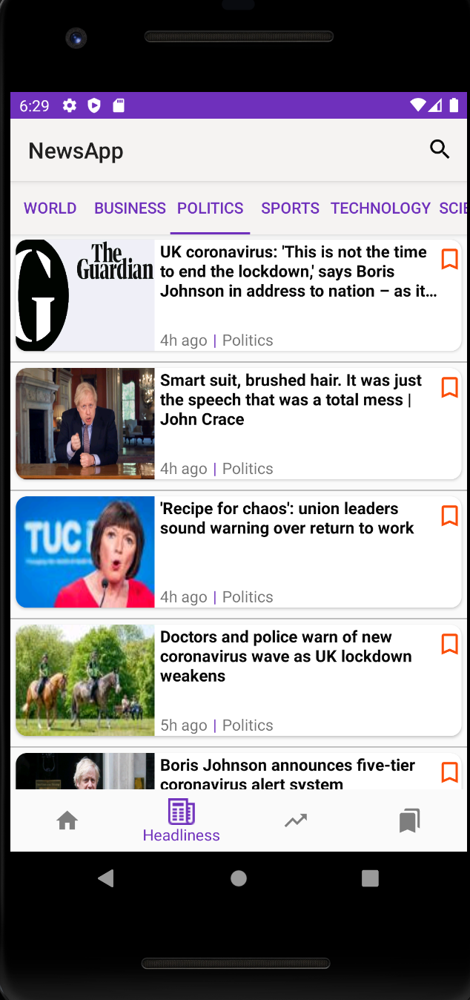
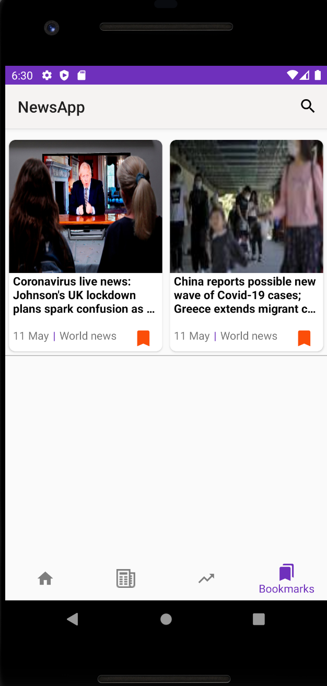
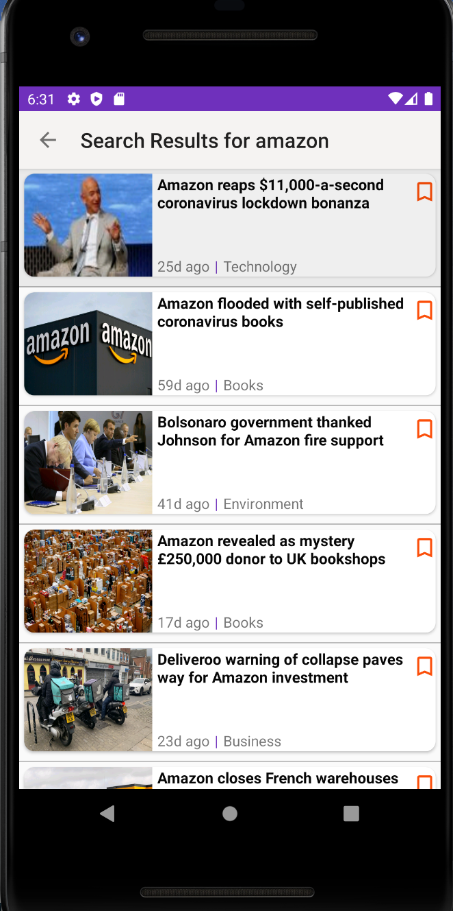
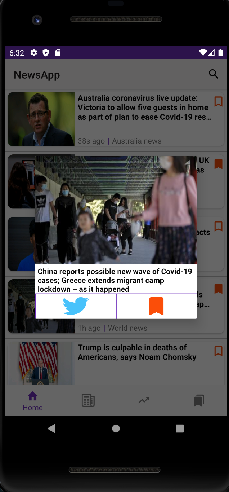

## Android News-app ##
An Android application, which allows users to search for latest news, look at detailed information about them, bookmark those news and post on Twitter about them.

When you open the app, there is a Toolbar at the top with the search icon and a Navigation bar at the bottom. Both of these persists for all the 4 tabs.
As soon as you open the app, the weather summary card of the current location of the user is displayed and below the weather card there is a list of 10 latest news as seen below. The current location is to be fetched from the emulator itself, which will be used to call the Openweathermap API to get the weather data.
The list of news is to be fetched from the Guardians API.

The headlines tab shows news cards from 5 different categories. The trends tab allows the user to enter a keyword and see the popularity and get trends for that for the last few years. Then, in the bookmarked tab, the user can see the news that they have bookmarked. Users can go to the details of a news card by tapping on it from the bookmarks, headlines, and home.

<h2>HomePage displaying news and current weather</h2>

<h2>Detailed Version of news</h2>

<h2>Section-Wise News</h2>

<h2>Trending Chart </h2>

<h2>Bookmarking functionality</h2>

<h2>Search Results</h2>

<h2>Long click Dialog box</h2>

